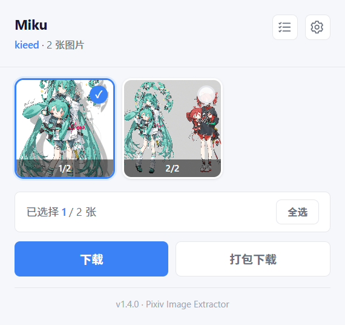

# Pixiv 图片提取

简体中文 · [English](README.en.md)

从 Pixiv 作品详情页预览、选择并下载原图的 Chrome 扩展。支持后台下载、ZIP 自动分卷和可暂停的下载任务。

[下载最新版本](https://github.com/Tainiraito/pixiv-image-extractor/releases/latest) · [版本记录](https://github.com/Tainiraito/pixiv-image-extractor/releases) · [反馈问题](https://github.com/Tainiraito/pixiv-image-extractor/issues)



## 功能

- 预览作品中的图片，逐张选择或全选；图片较多时可展开完整预览。
- 逐张保存原图，或打包为 ZIP；大型作品按张数和容量自动分卷。
- 关闭弹窗、切换标签页后继续下载；任务支持暂停、继续和重试未完成部分。
- 保存本地任务历史，并通过文件名模板自定义下载文件名称。

## 安装

需要 **Chrome 116 或更新版本**，并在浏览器中登录 Pixiv。

1. 在 [Releases](https://github.com/Tainiraito/pixiv-image-extractor/releases/latest) 下载 `pixiv-image-extractor-v版本号.zip`。
2. 解压到一个固定目录。
3. 打开 `chrome://extensions/`，开启「开发者模式」。
4. 点击「加载已解压的扩展程序」，选择解压后的 `pixiv-image-extractor` 文件夹（其中应有 `manifest.json`）。
5. 打开 Pixiv 作品详情页，点击工具栏中的扩展图标。

**更新已有安装：**将新版文件覆盖到原扩展目录，在扩展管理页点击「重新加载」，再刷新已打开的 Pixiv 页面。加载完成后保留该目录。

## 使用

1. 打开 `https://www.pixiv.net/artworks/作品ID`。
2. 点击扩展图标，勾选需要保存的图片，或点击「全选」。
3. 点击「下载」逐张保存原图，或点击「打包下载」生成 ZIP。选择多张或预计多卷时，按钮分别显示「逐张下载」「分卷下载」。
4. 在「下载任务」中查看进度。点击顶部的任务列表图标查看全部记录，点击齿轮调整下载设置。

预览默认最多显示三行；超过九张时，点击第九格的「查看全部」展开，之后可收起。收起不会改变选择，全选也包含未展开的图片。

## 下载任务

同一时间执行一个任务。暂停或停止当前任务后，可开始其他任务。

| 操作 | 行为 |
| --- | --- |
| 暂停 / 继续 | 暂停当前处理及正在写盘的下载；继续时跳过已保存的图片或 ZIP 卷。 |
| 重试 | 补下载失败或未完成的部分，保留已成功保存的内容。 |
| 停止 | 停止后续处理，已交给浏览器的下载继续执行。 |
| × | 移除已结束的任务记录，不删除下载文件。 |

首页最多展示三条未完成任务，进行中的任务优先显示；成功完成的任务自动移到完整列表。任务记录保存在本机，重开弹窗或浏览器后仍可查看；浏览器重启造成中断时，可重试未完成部分。

最多保留 50 条记录。满额再创建任务时，自动移除最早成功完成的记录；暂停、失败和部分失败的任务会保留。如果没有可清理的记录，需要先手动移除已结束的任务。

## 下载设置

点击顶部齿轮打开设置，修改后自动保存。

### 文件名模板

默认：`pixiv_{id}_{author}_{title}_p{index}`。扩展名自动添加，模板留空时使用默认值。

| 占位符 | 内容 |
| --- | --- |
| `{id}` | 作品 ID |
| `{author}` | 作者名 |
| `{title}` | 作品标题 |
| `{index}` | 页码 |

例如：`{author}-{title}-p{index}` → `作者名-作品标题-p1.jpg`。

### ZIP 分卷

每卷默认最多 30 张，可用滑块调整为 1～100 张，步进为 1。每卷同时受约 100 MiB 的容量限制，因此实际卷数可能多于按张数计算的预计值。分卷使用 `_part001.zip`、`_part002.zip` 命名。

## 支持范围与限制

- 支持 Pixiv 作品详情页中的静态图片，下载文件保存到浏览器设置的下载目录。
- 暂不支持 Ugoira 动图下载或转换。
- 卸载扩展或清除扩展存储会移除本地任务历史；已下载的文件不受影响。

## 开发与反馈

如遇到问题，请通过 [Issues](https://github.com/Tainiraito/pixiv-image-extractor/issues) 提供扩展版本、浏览器版本、复现步骤与错误信息。

<details>
<summary>源码结构与本地测试</summary>

撰写 README 与 Release 请遵守 [项目文档规范](docs/DOCUMENTATION_GUIDE.md)。

扩展使用 Manifest V3：`content.js` 提取作品信息，`background.js` 与 `task-runtime.js` 管理任务，`offscreen.js` 执行下载和 ZIP 打包，`popup.js` / `popup.html` 提供界面。共享配置位于 `config.js`。

项目无需构建，克隆后可直接按上面的安装步骤加载。回归测试使用 Node.js 内置测试运行器，无需安装 npm 依赖：

```shell
node --test tests/download-lifecycle.test.cjs
```

若环境禁止创建测试子进程，可使用 Node.js 24：

```shell
node --test --test-isolation=none tests/download-lifecycle.test.cjs
```

测试模拟 Chrome API 与图片响应，并检查 ZIP 内容，覆盖任务并发、历史、暂停/继续、重试及资源清理。它们不替代真实浏览器与 Pixiv 登录环境的验证。

</details>
